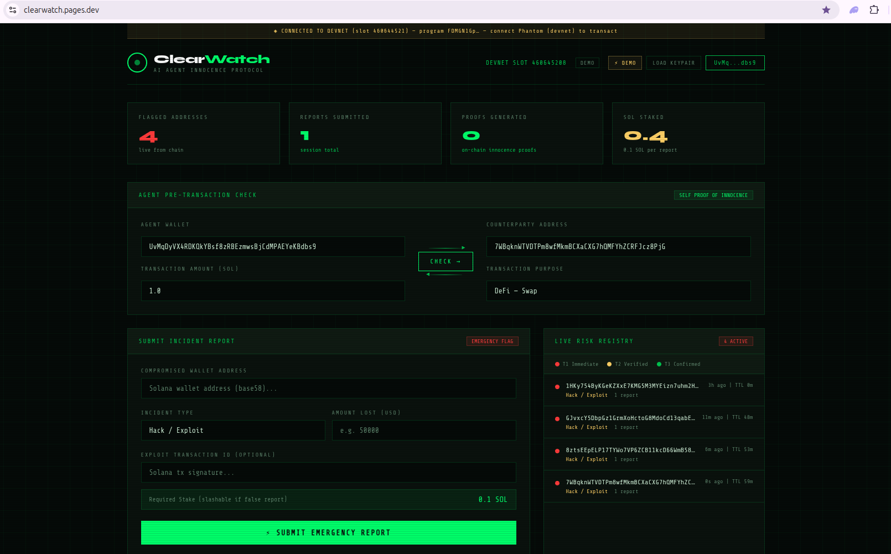
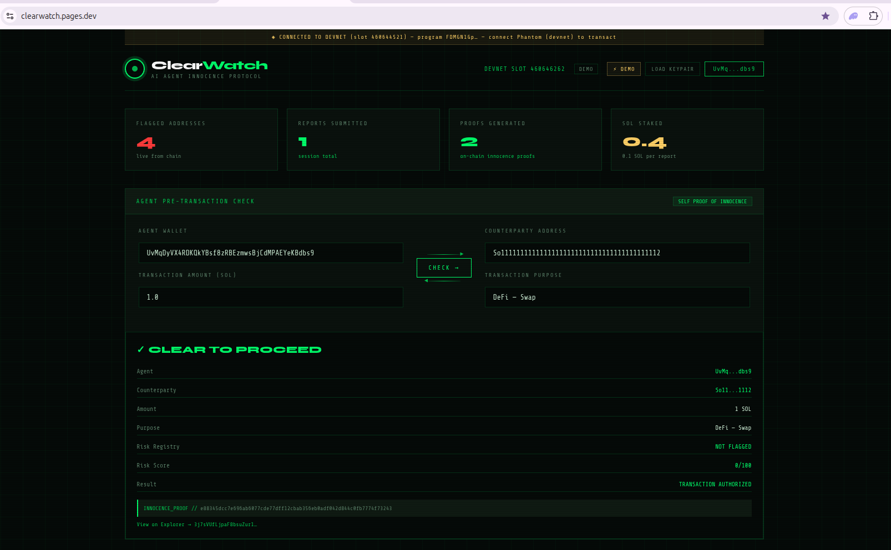
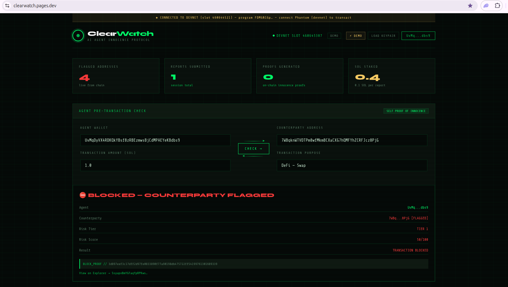

# ClearWatch

**Self Proof of Innocence for AI Agents — built on Solana.**

A real-time, community-reported risk registry that any AI agent can check in milliseconds before it sends funds. Every authorized transaction emits a cryptographic *Innocence Proof* on-chain, giving compliance teams the audit trail the AI agent economy doesn't have yet.

Submitted to **Colosseum Frontier 2026** — Privacy + Confidential Compute / Agents + Tokenization / Public Goods.



---

## The problem

Every week, millions are stolen in DeFi hacks. By the time the established AML providers update their blacklists, the funds are already laundered. The current AML stack was built for humans moving slowly. AI agents move in milliseconds — and they have no way to prove they followed the rules when no human was watching.

## The split

The architectural decision that everything else flows from:

```
Open Registry (public, free, permanent)
  Risk registry on Solana. Anyone can flag. Anyone can read.
  No company controls it. Survives the company that built it.

Self POI API (commercial)
  Paid SDK for AI agents that need cryptographic compliance proofs.
  Reads from the Open Registry. Adds enterprise audit features.
```

If the Self POI API succeeds: a compliance layer for the entire agent economy.
If it fails: the registry still exists — open, permanent, on-chain. **That asymmetry is the point.**

---

## Quickstart

The fastest path is the live deployment at **[clearwatch.pages.dev](https://clearwatch.pages.dev/)** — running against Solana devnet, no install required.

1. Open the URL in a fresh browser.
2. Set Phantom to Devnet (Settings → Developer Settings → Testnet Mode → Solana Devnet).
3. Click **CONNECT PHANTOM**, then **DEMO** to pre-fill a generated counterparty address.
4. **Submit Emergency Report** — flags the address at Tier 1 with a 0.1 SOL stake.
5. **Run Check** — the agent flow now blocks the transaction and emits a `BLOCK_PROOF`. Switch the counterparty to any unflagged address (e.g. `So11111111111111111111111111111111111111112`, the Wrapped-SOL mint) and the same check produces an `INNOCENCE_PROOF`.

You'll need a small amount of devnet SOL for fees and the 0.1 SOL stake — Phantom's devnet airdrop button or [solfaucet.com](https://solfaucet.com/) covers it.

| Pre-transaction CLEAR | Pre-transaction BLOCKED |
| :---: | :---: |
|  |  |

Read paths — browsing the registry, decoding on-chain accounts — work without any wallet connected. Only writes require a signer. The Open Registry can be inspected by anyone with no setup at all.

### Run it locally

Prefer a local validator (no devnet RPC, no rate limits, no Phantom setup)? One command:

```bash
./demo.sh
# then open http://localhost:8080/clearwatch.html
```

In the UI, click **LOAD KEYPAIR** and select `~/.config/solana/id.json` for signing. Phantom on localnet also works if you point its RPC at your local validator endpoint.

---

## Architecture

```
Victim / Reporter
   │ report_address(addr, type) + 0.1 SOL stake
   ▼
┌─────────────────────────────────────────────────┐
│  ClearWatch Protocol (Solana / Anchor)          │  ← Open Registry
│                                                 │
│  RiskEntry PDA (seeds: "risk_entry", addr)      │
│  ├─ Tier 1: instant, 1h TTL, slashable stake    │
│  ├─ Tier 2: corroborated by multiple reports    │
│  └─ Tier 3: confirmed                           │
│                                                 │
│  InnocenceProof PDA                             │
│  (seeds: "innocence_proof", agent, counter)     │
│  ├─ is_clear, risk_score, risk_tier_at_check    │
│  ├─ purpose_hash, amount, timestamp             │
│  └─ proof_hash (deterministic SHA256 commit)    │
└──────────────────┬──────────────────────────────┘
                   │ getAccountInfo, getProgramAccounts (free, permissionless)
                   ▼
┌─────────────────────────────────────────────────┐
│  AI Agent (Swig / Claude Code skill / SDK)      │  ← Self POI API
│                                                 │
│  pre-transaction:                               │
│    check_and_prove(counter, amount, purpose)    │
│      ├─ CLEAR  → execute transfer               │
│      └─ FLAGGED → block + alert                 │
│                                                 │
│  Innocence Proof persists on-chain forever.     │
└─────────────────────────────────────────────────┘
```

---

## Implemented today

The current submission ships **the Open Registry** and **the Self POI API** (with on-chain Innocence Proofs) on Solana devnet. Program ID `FDMGN1Gp62gK1TAnVvq2DM4HV6BhFwJ9Me5djLVKEKgB`. Live at **[clearwatch.pages.dev](https://clearwatch.pages.dev/)**.

### Open Registry

Permissionless, stake-secured, on-chain. Anyone can flag a compromised wallet at Tier 1 by staking 0.1 SOL; entries auto-expire after 1 hour unless promoted to Tier 2 or 3 via corroborating reports. The registry is read free of charge by anyone — no API key, no rate limit beyond what the validator imposes.

Implementation surface: `RiskEntry` PDA, plus `report_address` / `upgrade_tier` / `slash_reporter` instructions. Full instruction signatures and account schema are in [On-chain program](#on-chain-program) below.

### Self POI API

The agent-side primitive. Before sending funds, an AI agent calls `check_and_prove(counterparty, amount, purpose)`. The instruction reads the Open Registry, computes `is_clear` and `risk_score`, and writes a deterministic `InnocenceProof` PDA — a SHA256 commit over (agent, counterparty, amount, purpose_hash, is_clear, timestamp). Compliance teams get a verifiable audit trail without changing the agent's hot-path latency.

The `proof_hash` is reproducible client-side, so any third party can verify the on-chain state matches the inputs without trusting ClearWatch as an intermediary.

---

## On-chain program

**Program ID:** `FDMGN1Gp62gK1TAnVvq2DM4HV6BhFwJ9Me5djLVKEKgB`
**Framework:** Anchor 1.0.2

### Instructions

| Instruction | What it does |
|---|---|
| `report_address(flagged, incident_type)` | Creates a Tier-1 `RiskEntry` PDA. Locks 0.1 SOL into a `stake_vault` PDA. 1-hour TTL. |
| `check_and_prove(counterparty, amount, purpose)` | Reads optional `RiskEntry`; computes `is_clear` + `risk_score`; writes a deterministic `InnocenceProof` PDA. |
| `upgrade_tier(flagged, new_tier)` | Promotes Tier 1 → 2 → 3 once corroborated. Removes the TTL. |
| `slash_reporter(flagged, vault_bump)` | Closes a false report's `RiskEntry`, transfers the stake to the slashing authority. |

### Accounts

```rust
RiskEntry {
  address, tier, incident_type, reporter,
  stake_amount, timestamp, report_count, expires_at
}

InnocenceProof {
  agent, counterparty, amount, purpose_hash,
  is_clear, risk_score, risk_tier_at_check,
  timestamp, proof_hash // SHA256 over the proof inputs
}
```

---

## Project structure

```
programs/clearwatch/
├── src/
│   ├── lib.rs              — declare_id! + #[program] entry points
│   ├── state.rs            — RiskEntry / InnocenceProof
│   ├── error.rs            — ClearWatchError
│   ├── constants.rs
│   └── instructions/
│       ├── report_address.rs
│       ├── check_and_prove.rs
│       ├── upgrade_tier.rs
│       └── slash_reporter.rs
└── tests/
    └── test_clearwatch.rs  — 3 LiteSVM integration tests (all green)

clearwatch.html             — single-file UI, vanilla web3.js, manual Borsh
clearwatch-poi-skill.md     — Claude Code agent skill for the agent-side flow
demo.sh                     — one-command local demo
dist/index.html             — copy of clearwatch.html, deployed to Cloudflare Pages
```

The frontend deliberately ships **no build step and no node_modules**. It loads `@solana/web3.js` from a CDN, derives PDAs in the browser, and encodes instruction data with hand-rolled Borsh against the IDL discriminators. Anyone can view the source and audit it.

---

## Roadmap

ClearWatch's planned extensions divide into three categories: enhancements to the registry's data and semantics; new surfaces that open the protocol to ecosystems beyond AI agents; and a cross-cutting privacy primitive that composes with all of the above.

None of the sections below ship in this hackathon submission; each closes with an explicit status line.

### Source-Diverse Registry — registry enhancement

The Tier-1 community-flag flow handles the "victim-reports-immediately" case. It does not handle the cold-start problem — when there is nothing in the registry, agents have nothing to consult — and it does not capture the long tail of compromised addresses that are already public knowledge in places ClearWatch isn't watching. Both gaps require a path that pulls authoritative external sources directly into the registry.

#### Ingestion targets

| Source | Type | Use |
|---|---|---|
| US OFAC SDN List | Sanctions | Mandatory blocking for compliance-bound counterparties |
| EU consolidated list | Sanctions | EU equivalent |
| UK HMT consolidated list | Sanctions | UK equivalent |
| UN Security Council list | Sanctions | International scope |
| Rekt News exploit DB | Public exploit DB | Hacker addresses from documented incidents |
| DefiLlama Hack Tracker | Public exploit DB | Cross-validates Rekt; richer metadata |
| Mixer / bridge exploit pools | Network analysis | Aggregated outflow addresses from Tornado Cash, cross-chain bridge exploits |
| Public phishing DBs (CC-licensed) | Phishing | Drainer addresses from Scam Sniffer, Pocket Universe, etc. |

#### Schema additions to `RiskEntry`

```rust
RiskEntry {
  // existing fields ...
  source_type: SourceType,            // Community | Ofac | Eu | Uk | Un | Exploit | Phishing
  source_reference: String,           // e.g. "OFAC SDN 2026-04-12"
  source_attestation: [u8; 32],       // SHA256 of the canonical source row + publication date
  ingested_at: i64,
  ingested_by: Pubkey,                // ingestor program PDA or signing wallet
}
```

`source_attestation` is content-addressable: the canonical source row plus its publication date hashed together. Two ingestors processing the same OFAC update converge on the same hash, so downstream consumers can verify provenance without trusting any individual ingestor.

#### Auto-promotion path

Authoritative-source entries (OFAC, EU, UK, UN) bypass Tier-1 and write at Tier-3 directly. No new instruction is required — the existing `tier` field plus a `source_type`-aware policy in `report_address` (or a sibling `report_authoritative` instruction) handles the difference. The Tier-2 corroboration path remains intact for community-driven escalation.

#### Why this is a public good, not a competitor to established AML providers

Vendor risk APIs — the established AML providers — are **proprietary, gated, $50,000 to $500,000 per year** services. They sell access to a private database, exposed through an API contract.

ClearWatch is **an on-chain primitive**. A smart contract can `CPI` into `check_and_prove` (or `check_only`, on the [Ecosystem Integration](#ecosystem-integration--new-surface) roadmap) the same way it would `transfer` from the SPL token program. There is no API key, no contract negotiation, no per-call billing.

The data overlap is real. The mode of access is fundamentally different.

ClearWatch is **infrastructure for compliance verification** — the rails on which compliance checks happen. It is *not* a compliance solution; it does not opine on whether a transaction is "compliant" with any specific jurisdiction. That responsibility belongs to the integrating protocol. We supply the on-chain risk signal; the application decides what to do with it.

The structural gap this fills is not "another risk API alongside the existing vendors." It is the absence of any on-chain compliance primitive that smart contracts can compose with at all. Every existing vendor lives outside the chain.

#### Status

Roadmap, not implemented in this hackathon submission.

### Risk Graph — registry enhancement

A direct-flag registry catches the addresses that get reported. It does not catch the addresses receiving funds *from* a flagged address — and exploit funds typically fan out across dozens of fresh wallets within minutes of the initial breach.

The Risk Graph extends the Open Registry with **transitive risk propagation**: if address `A` is flagged at Tier 3, and `B` receives 90% of its inflow from `A` within the last 48 hours, `B` should carry derived risk even though no human reported it.

#### Hybrid architecture

Computing transitive risk on every check is too expensive for an on-chain program. The Risk Graph runs as an off-chain indexer that crawls the Solana ledger, applies the propagation algorithm, and writes the result as a `DerivedRiskEntry` PDA on-chain — signed and timestamped by the indexer.

```rust
DerivedRiskEntry {
  address: Pubkey,
  root_sources: Vec<Pubkey>,          // upstream flagged addresses
  hops_from_nearest: u8,              // shortest path to a flagged root
  aggregate_risk: u8,                 // 0–100, after decay + amount weighting
  propagation_paths: Vec<PathSummary>,// up to N attestable paths to roots
  last_computed: i64,
  indexer: Pubkey,
  indexer_signature: [u8; 64],        // signs (address, aggregate_risk, last_computed, algorithm_version)
  algorithm_version: u8,
}
```

Consumers query a `DerivedRiskEntry` the same way they query a `RiskEntry`. The signature lets them verify that a specific indexer attests to the score; the `algorithm_version` lets them filter by acceptable methodology.

#### Propagation algorithm — four axes

1. **Hop-based decay.** Score halves with each hop along the funds-flow graph (`decay ≈ 0.5`); after roughly three hops, derived risk falls below the typical action threshold. Direct receivers from a Tier-3 root keep most of the risk; a wallet four steps removed carries effectively none.
2. **Amount-weighted threshold.** Inflows under 1 % of the receiving wallet's total volume in the propagation window are not tracked. This neutralizes dust-attack contamination — an attacker can't poison a clean wallet by spraying 1 lamport from a flagged address.
3. **Time-windowed propagation.** The decay window is 24 to 72 hours, configurable per source severity. Funds that have settled for longer than the window stop propagating. This prevents permanent contamination — an address that received tainted funds years ago and has since transacted normally is not blocked forever.
4. **Termination conditions.** Propagation stops at known mixers (Tornado Cash and equivalents), CEX hot wallets (deposit endpoints aren't user wallets), explicitly whitelisted protocol PDAs (Jupiter aggregator, Wormhole token bridge), and dust thresholds. Termination is what keeps the graph computable in bounded time.

#### Trust model evolution

| Phase | Indexer model | Verifiability |
|---|---|---|
| 1 | ClearWatch-operated, open-source policy and code | Anyone can re-derive the score from on-chain data and the published algorithm; deviation is detectable |
| 2 | Multiple competing indexers, distinguished by signature | Consumers pick which indexer they trust; the on-chain primitive is indexer-agnostic |
| 3 | ZK-proven propagation | Indexer publishes a SNARK that the on-chain `aggregate_risk` was correctly derived from on-chain state |

Each phase preserves backward compatibility with the previous one. Phase-2 indexers run alongside the Phase-1 ClearWatch indexer; Phase-3 ZK proofs sit alongside signed attestations rather than replacing them.

#### New instruction: `check_with_propagation`

```rust
pub fn check_with_propagation(
  ctx: Context<CheckWithPropagation>,
  counterparty: Pubkey,
  amount: u64,
  purpose: String,
  max_hops: u8,                  // caller's cap on how deep to consider risk
  min_score_threshold: u8,       // below this, treat as clear
) -> Result<ProofResult>
```

The instruction reads either `RiskEntry` (direct flag) or `DerivedRiskEntry` (transitive flag), takes whichever score is higher, and applies the caller-supplied threshold. The `InnocenceProof` records both the direct and the derived score, so the audit trail captures *why* a check passed or failed.

#### Three-tier check comparison

| | `check_only` (Ecosystem Integration) | `check_with_propagation` (Risk Graph) | `check_and_prove` (Self POI API) |
|---|---|---|---|
| Reads direct registry | yes | yes | yes |
| Reads risk graph | no | yes | not yet |
| Writes `InnocenceProof` PDA | no | yes | yes |
| Compute units | lowest | medium | low |
| Use case | DEX aggregator pre-trade screen | bridge / treasury / cross-chain settlement | agent compliance audit trail |

#### Composition with Arcium

The Bloom-filter design in [Confidential Checks via Arcium](#confidential-checks-via-arcium--cross-cutting-privacy) extends naturally to the Risk Graph. Instead of a Bloom filter over flagged addresses, the MPC circuit takes an encrypted counterparty pubkey and returns an encrypted `aggregate_risk` score from a precomputed score table — privacy-preserving transitive risk lookup without revealing which counterparty was queried.

#### Status

Roadmap, not implemented in this hackathon submission.

### Ecosystem Integration — new surface

The InnocenceProof primitive is composable. The current implementation is agent-centric, but the design extends naturally to any Solana program that wants a compliance check primitive: DEX aggregators (Jupiter), bridges (Wormhole), wallets (Phantom), launchpads, custodial services.

Three program-level extensions enable this. Two broader directions sit beyond them.

#### `check_only` — read-only risk gate

A pure read instruction that returns `(is_clear, risk_score)` without writing an `InnocenceProof` PDA. Designed for high-throughput callers like DEX aggregators where every swap pays compute units. Eliminates the rent + write cost of `check_and_prove` for use cases that don't need the audit trail.

#### Caller-keyed PDAs (vs agent-keyed)

Generalize the `InnocenceProof` PDA seed from

```
["innocence_proof", agent, counterparty]
```

to

```
["innocence_proof", caller, counterparty]
```

where `caller` can be any program PDA, user wallet, or AI agent. Each integrating protocol gets its own proof namespace — no collisions between Jupiter, Wormhole, and downstream consumers.

#### `check_only_batch` — multi-counterparty checks

For bridges and aggregators that process multiple addresses per transaction. A single instruction with `Vec<Pubkey>` input and `Vec<RiskResponse>` output via `remaining_accounts`. Compute-unit-efficient batch read for routing flows.

#### Trust framework (further out)

Production integration by Jupiter / Wormhole-tier protocols requires stronger guarantees on registry accuracy than a community-stake registry alone provides: a certified reporter program, formal dispute resolution, slashing automation. This is the post-MVP trust layer that turns ClearWatch from a community resource into institutional infrastructure.

#### Off-chain attestation path

For ultra-high-throughput integrations, an off-chain attestation model (similar to the off-chain attestation oracles offered by incumbent AML vendors) where signed risk attestations are bundled into the calling tx. Pairs naturally with the [Confidential Checks via Arcium](#confidential-checks-via-arcium--cross-cutting-privacy) — risk evaluation happens in MPC, only a signed result reaches Solana.

#### Status

Roadmap, not implemented in this hackathon submission.

### Confidential Checks via Arcium — cross-cutting privacy

The current `check_and_prove` instruction reveals the counterparty pubkey on-chain. For most agent-economy use cases that's fine — *who you check* is already telegraphed by the transfer that follows. But for high-frequency trading agents, treasury management agents, and any flow where the *intent* to interact is itself sensitive, the public check leaks the agent's strategy.

This is the gap [Arcium](https://docs.arcium.com/developers) was built for. The integration design below fits Arcis's MPC constraints (fixed-shape data, no variable-length loops, encrypted scalars are 32 bytes each):

#### Design — Bloom-filter membership check

```
on-chain (public)             Arcis circuit (encrypted)        agent client
─────────────────             ──────────────────────────       ─────────────
RiskFilter account                                             encrypt(counterparty)
  bloom: [u64; 16]            #[instruction]                   ─────────────────────►
  m bits, k hashes            pub fn confidential_check(
  updated by report_address     enc_counter: Enc<Shared, Pk>,    submit MPC tx
                                bloom: [u64; 16],                with ciphertext
                              ) -> Enc<Shared, CheckResult> {
                                let pk = enc_counter.to_arcis();
                                let h1 = hash1(pk);
                                let h2 = hash2(pk);
                                let h3 = hash3(pk);
                                let hit = bit(bloom, h1)
                                       && bit(bloom, h2)
                                       && bit(bloom, h3);
                                enc_counter.owner.from_arcis(
                                  CheckResult { is_clear: !hit, ... }
                                )
                              }
```

**What changes on-chain:**
- New `RiskFilter` account: 1024-bit Bloom filter (`[u64; 16]`) over the active flagged-address set. Updated by `report_address` / `slash_reporter` / `expire`. Public, free to read.
- New `confidential_check_and_prove` instruction: queues an Arcis computation, writes an `InnocenceProof` with `is_clear` *encrypted to the agent* (`Enc<Shared, bool>`).
- The plaintext `RiskEntry` accounts stay — the Bloom filter is a *summary* the MPC circuit can fit in, not a replacement.

**What changes off-chain:**
- Agent client encrypts `counterparty` with the program's MXE public key + agent's x25519 keypair (derived from wallet signature for recoverability).
- Submits the encrypted ciphertext + the on-chain Bloom filter bits as ArgBuilder inputs.
- Decrypts the callback result locally. The chain — and any observer — sees only the ciphertext and a "check happened" event.

#### Tradeoffs (honest)

| | Trade |
|---|---|
| **False positives** | Bloom filter at 1024 bits with k=3 hashes gives ~1% FP at 100 active flags, ~10% at 500. Acceptable for the agent flow (FP = unnecessary block, not unsafe transaction); tunable by sizing. |
| **Filter freshness** | The Bloom filter must be rebuilt when entries expire. Easiest path: rebuild on every `report_address` / on T1 expiry tick. Heavier path: cumulative bloom + per-tick "removed-set" diff. |
| **MPC latency** | Arcium computations finalize in seconds, not the milliseconds of a plain Solana tx. Fine for treasury / payment flows; not for HFT pre-trade checks. |
| **Plaintext fallback** | The original `check_and_prove` stays. Agents that don't need confidentiality use the cheap path. Privacy is opt-in, not forced. |

#### Composition with the Risk Graph

The same MPC primitive that supports membership checks against the Bloom filter extends to score lookups against the [Risk Graph](#risk-graph--registry-enhancement). An encrypted counterparty pubkey can be matched against an encrypted score table inside Arcis, returning an encrypted `aggregate_risk` score without revealing the query target — privacy-preserving transitive risk lookup, the closest thing on Solana to a confidential, on-chain risk score.

#### Status

**Designed, not yet built.** The Anchor program, the UI, and the LiteSVM tests in this repo all exercise the plaintext path. The Arcium integration is scoped for post-hackathon work — pitched here so judges can see the privacy story we're playing for, not as a finished claim.

References used: `arcium` skill at `.claude/skills/arcium/SKILL.md`, [Arcium docs](https://docs.arcium.com/developers), [arcium-hq/examples](https://github.com/arcium-hq/examples).

---

## Tests

```
running 3 tests
test test_check_and_prove_blocked ... ok
test test_check_and_prove_clear   ... ok
test test_report_address          ... ok
```

Run them yourself:

```bash
source ~/.cargo/env
cargo test --manifest-path programs/clearwatch/Cargo.toml --release
```

Tests use [LiteSVM](https://github.com/LiteSVM/litesvm) — no validator process, no RPC, in-process Solana runtime.

---

## Tracks

- **Privacy + Confidential Compute** — concrete integration design with Arcium for confidential risk checks. See [Confidential Checks via Arcium](#confidential-checks-via-arcium--cross-cutting-privacy).
- **Agents + Tokenization** — the Innocence Proof is the agent-economy primitive that didn't exist before.
- **Treasury + Security** — staking + slashing keeps the registry honest without a centralized moderator.
- **Public Goods** — the Open Registry is permissionless and free to read forever.

---

## What this is not

- **Not a competitor to established AML providers** like the major commercial blockchain analytics vendors. ClearWatch fills a different structural gap: an on-chain compliance primitive that smart contracts can compose with. The data overlap is real; the mode of access is fundamentally different.
- **Not a closed API.** The registry is on-chain. Anyone can read it without an API key. The paid Self POI API is optional and reads the same registry anyone else can.
- **Not a compliance solution.** It is **infrastructure for compliance verification** — the rails on which integrating protocols make their own jurisdiction-specific decisions. We supply the on-chain risk signal; the application decides what to do with it.
- **Not finished.** Tier-2/3 escalation, multi-reporter aggregation, source-diverse ingestion, the risk graph, ecosystem CPI extensions, and the Arcium MPC integration are designed (see [Roadmap](#roadmap)) but not all production-grade. The plaintext, agent-only flow ships; the rest is scoped post-hackathon. The full design notes are in [`CLAUDE.md`](./CLAUDE.md).

---

## Build from source

This repository builds on a system without `gcc` by using Solana's bundled clang. See [`CLAUDE.md`](./CLAUDE.md) for the env setup if you hit linker errors.

```bash
source ~/.cargo/env
export PATH="$HOME/.local/bin:$HOME/.local/share/solana/install/active_release/bin:$PATH"
cargo build-sbf
```

Output: `target/deploy/clearwatch.so` (~205 KB).

---

## License

MIT.
